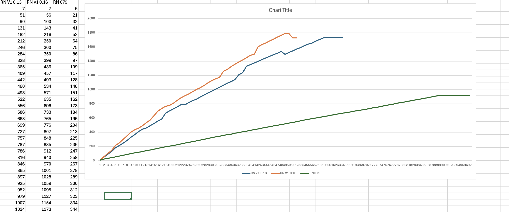

# Memory consumption comparison beween hermes (RN79), hermes V1(0.13) and hermes V1(0.16)

Since the upgrade to hermes V1 on .79 branch we noticed considerable higher memory consumption (130-150MB+). As part of the investigation I ran simple memory benchmark(benchmark.js) to see the difference in between of mentioned versions and was surpriced to find that V1 version despite being faster also consume significantly more memory ... 

This repository has complete setup including memory sampling tool that demonstrates the issue on three standalone hermes builds.

# Limitations of this setup

Was only tested on osx (Tahoe, 26.5.1). Memory sampler implementation was built pretty fast so the error handling there is not the best.  Essentialy it's running following command (that also could be achieved by calling it from bash): ```ps -axm -o rss,comm | grep -i hermes```

# Versions tested in this benchmark

1. ```hermes-v250829098.0.16```
2. ```hermes_v250829098.0.13```
3. ```hermes_RNv0.79.3_7f9a871eefeb2c3852365ee80f0b6733ec12ac3b```

# How memory consumption was sampled
1. ```-gc-print-stats```  (heapSize value)
2. ```ps -axm -o rss,comm | grep -i hermes```

Both ways showed very similar memory footprints

# Hardware

Macbook Pro M3 (36GB)

# Prerequisites

1. All benchmarks were ran on osx, on any other OS you will probably have to adjust commands in memory_sampler
2. CMake
3. Xcode command line tools

# How to run this setup

Execute ```run.sh```

# Benchmark Stages 

1. Clone all three versions of hermes to their own separate folders (hermes-v250829098.0.16, hermes_v250829098.0.13, hermes_RNv0.79.3_7f9a871eefeb2c3852365ee80f0b6733ec12ac3b)
2. Build each one with release flag (-DCMAKE_BUILD_TYPE=Release)
3. Build memory sampler tool (release flags, cmake)
4. Start memory sampler tools in parallel with hermes process
5. Kill (by interrupt) sampling tool that will output csv file into results/ folder
6. Repeat for each version

# Commands used

Memory sampling:
```ps -axm -o rss,comm | grep -i hermes```

Hermes benchmark:
```hermes benchmark.js -gc-print-stats -gc-before-stats```

# Results
Both V1 .16 and V1 .13 completed benchnark with very similar memory footprint of about ```1.8GB```
Non V1 version (rn79) completed benchmark with ```950mb```



# Further findings / Updates

I found out that newer version of Hades / Hermes is more dependent on max allowed heap size and is able to operate more efficiently when this is set to limited value. Using following param i was able to get memory usage down to 500+MB from almost 2GB ```-gc-max-heap=512M```. Now the question is how to tell hades/hermes to prioritize usage minimum viable memory instead of relying on fixed max heap value ...

Update: specifying large_heap=512MB on .16 cuts execution time by more than 3x ?? Why
